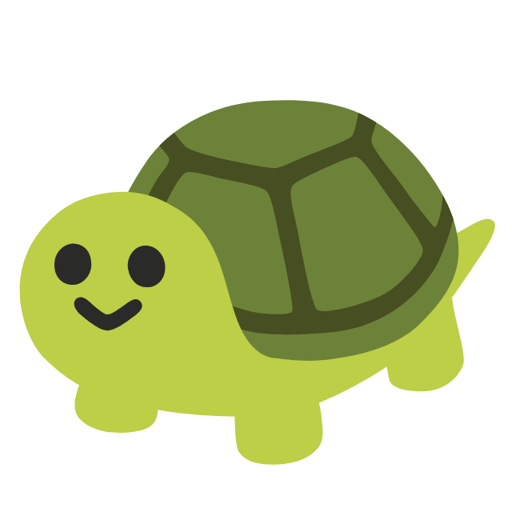

<h1 align="center">Hi 👋, I'm Supakit Wiwustrinon</h1>
<h3 align="center">A passionate full-stack Developer & Software Engineer from Thailand 🇹🇭</h3>

  

  

- 🔭 I’m currently working on [Lunar](https://github.com/dazcalifornia/Lunar)

- 👨‍💻 All of my projects are available at [https://www.franx.dev/](https://www.franx.dev/)

- 📝 I regularly write articles on [https://www.franx.dev/](https://www.franx.dev/)

- 📫 How to reach me **franx.essential@gmail.com**

- ⚡ Fun fact **I think I'm workaholic and I really talk a lot**

<h3 align="left">Mylasted Project</h3>
</img>

<h3 align="left">Connect with me:</h3>

### 🚀 Languages and Tools

<table>
  <tr>
    <td>Android</td>
    <td>Angular</td>
    <td>Arduino</td>
  </tr>
  <tr>
    <td>Bash</td>
    <td>Blender</td>
    <td>Bootstrap</td>
  </tr>
  <tr>
    <td>Bulma</td>
    <td>C</td>
    <td>C++</td>
  </tr>
  <tr>
    <td>CSS3</td>
    <td>Dart</td>
    <td>Docker</td>
  </tr>
  <tr>
    <td>Electron</td>
    <td>Express</td>
    <td>Figma</td>
  </tr>
  <tr>
    <td>Firebase</td>
    <td>Flask</td>
    <td>Flutter</td>
  </tr>
  <tr>
    <td>Framer</td>
    <td>Google Cloud</td>
    <td>Git</td>
  </tr>
  <tr>
    <td>Go</td>
    <td>GraphQL</td>
    <td>HTML5</td>
  </tr>
  <tr>
    <td>Illustrator</td>
    <td>Java</td>
    <td>JavaScript</td>
  </tr>
  <tr>
    <td>Kotlin</td>
    <td>Laravel</td>
    <td>Linux</td>
  </tr>
  <tr>
    <td>MongoDB</td>
    <td>MySQL</td>
    <td>Next.js</td>
  </tr>
  <tr>
    <td>Nginx</td>
    <td>Node.js</td>
    <td>OpenCV</td>
  </tr>
  <tr>
    <td>Pandas</td>
    <td>Photoshop</td>
    <td>PHP</td>
  </tr>
  <tr>
    <td>Postman</td>
    <td>React</td>
    <td>React Native</td>
  </tr>
  <tr>
    <td>Realm</td>
    <td>Scikit-Learn</td>
    <td>Seaborn</td>
  </tr>
  <tr>
    <td>Svelte</td>
    <td>TailwindCSS</td>
    <td>TensorFlow</td>
  </tr>
  <tr>
    <td>TypeScript</td>
    <td>Unity</td>
    <td>Vue.js</td>
  </tr>
  <tr>
    <td>Xamarin</td>
    <td>Adobe XD</td>
    <td></td>
  </tr>
</table>

&nbsp;

