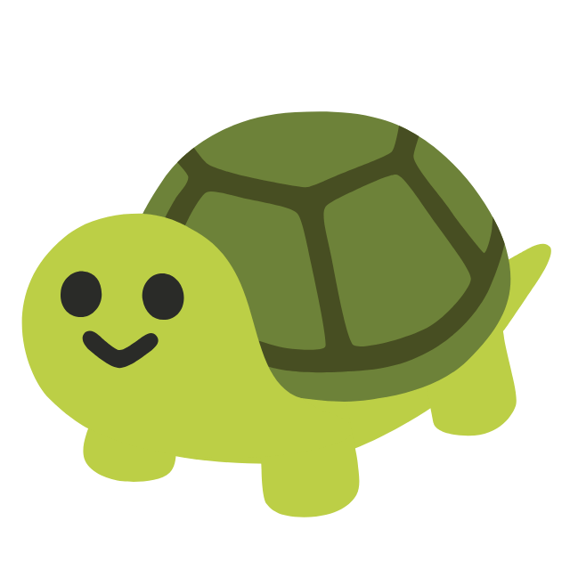

# 🚀 Supakit Wiwustrinon | Full-Stack Developer

<div align="center">
  
[](http://franx-webpage.vercel.app/)

### 👨‍💻 Passionate Full-Stack Developer & Software Engineer from Thailand 🇹🇭


[](https://github.com/dazcalifornia)
[](https://twitter.com/essentialfranx)

</div>

---

## 🎯 About Me

```typescript
const supakit = {
    code: ["JavaScript", "TypeScript", "Python", "Java", "C++", "Go", "Dart"],
    askMeAbout: ["web dev", "mobile dev", "UI/UX", "tech", "system design"],
    technologies: {
        frontEnd: {
            js: ["React", "Next.js", "Vue", "Angular", "Svelte"],
            css: ["TailwindCSS", "Bootstrap", "Styled Components"]
        },
        backEnd: {
            js: ["Node.js", "Express"],
            python: ["Django", "Flask"],
            php: ["Laravel"],
            databases: ["MongoDB", "MySQL", "Firebase"]
        },
        mobile: ["React Native", "Flutter"],
        devOps: ["Docker", "Google Cloud", "Nginx"],
        tools: ["Git", "Figma", "Postman", "Linux"]
    },
    currentProject: "Lunar - Next-gen project management platform",
    funFact: "I'm a workaholic who loves to talk! ☕️"
};
```



### 🌟 Quick Facts

- 🔭 **Currently building:** [Lunar](https://github.com/dazcalifornia/Lunar) - An innovative project management solution
- 🌐 **Portfolio:** [franx.dev](https://www.franx.dev/) - Check out my latest work
- ✍️ **Tech Blog:** Sharing insights and tutorials at [franx.dev](https://www.franx.dev/)
- 📧 **Reach me:** franx.essential@gmail.com
- ⚡ **Fun fact:** I think I'm a workaholic and I really talk a lot!

---

## 🏆 Latest Project Spotlight

<div align="center">
  
[](https://github.com/dazcalifornia/Telex-PROJECT_CS)

</div>

---

## 🛠️ Tech Stack & Tools

<div align="center">

### 💻 Languages


### 🚀 Frontend & Frameworks


### ⚙️ Backend & Databases


### 🎨 Styling & Design


### 🛠️ Tools & Platforms


### 🧠 Data Science & ML


</div>

---

## 📊 GitHub Analytics

<div align="center">
  


</div>

<div align="center">
  
[](https://github.com/dazcalifornia)

</div>

---

## 🏆 GitHub Trophies

<div align="center">
  
[](https://github.com/dazcalifornia)

</div>

---

## 🤝 Let's Connect!

<div align="center">

[](https://twitter.com/essentialfranx)
[](https://www.franx.dev/)
[](mailto:franx.essential@gmail.com)

</div>

---

<div align="center">

### ✨ "Code is like humor. When you have to explain it, it's bad." - Cory House


⭐️ From [Supakit Wiwustrinon](https://github.com/dazcalifornia) with ❤️

</div>
